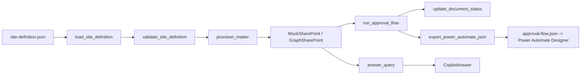

# Accounting doc + PM system

[](https://github.com/derekgallardo01/accounting-doc-mgmt/actions/workflows/ci.yml) [](LICENSE) [](#) [](https://codespaces.new/derekgallardo01/accounting-doc-mgmt)

**Docs:** [Getting started](docs/getting-started.md) · [Architecture](docs/architecture.md) · [Customization](docs/customization.md) · [Evaluation](docs/evaluation.md) · [Diagrams](docs/diagrams.md) · [FAQ](docs/faq.md)

**Live demo:** [derekgallardo01.github.io/accounting-doc-mgmt](https://derekgallardo01.github.io/accounting-doc-mgmt/) — 10-client accounting firm mock tenant with 19 matters, full onboarding walkthrough, Copilot query answers, regenerated on every push.

**SharePoint + Power Automate document / project management system**
for accounting firms. JSON-defined site + client-matter libraries,
approval flows with retry + dead-letter queue, and a Copilot query
layer that answers "what's the status of matter X?" in plain English.

Stub-by-default with a bundled 10-client mock tenant. Documented Graph
swap point.

```bash
pip install -e .
accounting-docs demo                                        # end-to-end walkthrough
accounting-docs list-matters                                # all matters across clients
accounting-docs list-matters --json                         # machine-readable
accounting-docs validate-site                               # check site definition
accounting-docs flow-export --out approval-flow.json        # Power Automate JSON
accounting-docs ask "What's the status of matter m-01-tax-2026?"
accounting-docs ask "Which matters are due in the next 30 days?"
accounting-docs capacity-forecast --horizon-weeks 52        # tax-season staff planner
accounting-docs client-portal m-01-tax-2026                 # provision external client portal
```

```bash
python -m pytest -q     # 58 unit tests
python evals/run.py     # 7 golden eval cases
```

Stdlib-only Python on the default path. `msgraph-sdk` + `msal` are
optional extras for the production SharePoint path.

## Run in Docker

```bash
docker build -t accounting-docs .
docker run --rm accounting-docs                             # `accounting-docs demo`
docker run --rm accounting-docs pytest -q                   # tests
```

## Example: production scenario

**[examples/onboard_client.py](examples/onboard_client.py)** — Full end-to-end client onboarding pipeline: validate site definition → provision new client + 3 matters (tax + Q3 + advisory) → run approval flow → answer 3 Copilot queries. Emits a single `client-onboarding-report.md`.

```bash
python examples/onboard_client.py
```

## What it's for

Every accounting firm builds the same doc-management system by hand,
badly, in the first month of engagement:

1. **Client-matter document library structure** — some folders per
   matter, some metadata columns per library, some retention per
   library, always wrong the first time
2. **Approval flows** — preparer self-review → senior review →
   partner sign-off with retries and a dead-letter queue for stuck
   documents
3. **"Where does matter X stand?"** — the partner asks this five
   times a day; nobody has a fast answer without walking the whole
   folder tree

The kit ships all three:

- **JSON-defined site definition** with schema validation. Copy the
  default, edit for the client's specific matter types, deploy.
- **Approval flow simulator + Power Automate JSON export.** Test the
  flow deterministically in CI; export the shape for a real Power
  Automate deployment.
- **Copilot query layer** answering 3 canonical question shapes:
  matter status, upcoming due dates, unsigned documents for a client.

## The four libraries

The default site definition ships with four libraries, each with
matter_id-required metadata and different retention:

| Library | Purpose | Metadata columns | Retention |
|---|---|---|---|
| Source Documents | Client-provided (W-2s, 1099s, receipts) | matter_id, doc_type, tax_year, received_from_client | 7 years |
| Workpapers | Internal work + memos | matter_id, review_status, preparer, reviewer | 7 years |
| Deliverables | Signed returns, audit reports | matter_id, doc_type, final_partner_signoff, delivered_to_client_at | 7 years |
| Correspondence | Emails, phone logs, notes | matter_id, author, communication_type | 3 years |

The site is defined in
[`site_definition.py::DEFAULT_SITE`](src/accounting_doc_mgmt/site_definition.py)
and can be loaded from JSON via `load_site_definition("path.json")`.

## The approval flow

Three-step approval per document with retry-then-DLQ semantics:

```
      preparer self-review
              |
              v
     senior accountant review
              |
              v
      partner sign-off
              |
              v
          [ approved / rejected / abstained / dead-lettered ]
```

Rejection at any step restarts the flow (up to `MAX_RETRIES=2`
attempts). After max retries, the document goes to the
`sharepoint_list://Flow-DLQ` list for manual triage.

Export the equivalent Power Automate JSON:

```bash
accounting-docs flow-export --out approval-flow.json
```

Then import into Power Automate Designer and wire the
`SendApprovalRequest` action to your actual approver identities.

## The Copilot query layer

Three canonical intents, keyword-classified against the query:

- `matter_status` — "what's the status of matter X?" (returns client,
  kind, due date, document counts by review status)
- `due_in_days` — "which matters are due in the next N days?" (defaults
  to 30 if N missing)
- `unsigned_docs_for_client` — "show me unsigned documents for
  {client name}"

Deterministic backend by default; swap to Claude via
`ACCOUNTING_LLM=claude`. See [`docs/customization.md`](docs/customization.md).

```
$ accounting-docs ask "What's the status of matter m-01-tax-2026?"
[matter_status] Matter m-01-tax-2026 - Ridgeway Bakery - tax return for
2026. Status: in_review. Due 2027-04-15. Documents: draft=1,
in_review=1, signed_off=3. Partner: sarah.jones@acmecpas.onmicrosoft.com.
Senior: raj.patel@acmecpas.onmicrosoft.com.
```

## Tax-season capacity planner

Every accounting firm hits the same problem in mid-January: they think
they have enough staff for the April 15 deadline, then realize on
March 10 that they don't. By then it's too late to hire. The capacity
planner projects weekly demand vs supply against the current matter
book and flags the specific weeks + roles + FTE gap:

```
$ accounting-docs capacity-forecast --horizon-weeks 52
Capacity forecast: 52 weeks, 1 bottleneck slots,
0 hiring suggestions, 1 outsource suggestions

Bottleneck weeks (demand > supply):
  2027-04-12  Senior Accountant     demand=60h  supply=40h  deficit=20h

Outsource suggestions:
  - tax_return            ~60h to reassign
      'tax_return' matters contribute 100% of total capacity deficit
      (60 hours). Consider outsourcing overflow.
```

Per-role effort estimates per matter kind are tunable in
[`capacity_planner.py::DEFAULT_EFFORT_ESTIMATES`](src/accounting_doc_mgmt/capacity_planner.py).

## Client portal provisioner

Small accounting firms typically start with clients emailing PDFs
around. That works until the firm gets audited on data handling and
someone asks 'where's the audit trail for who accessed which W-2?'.
The client portal is the answer: guest access to a specific matter's
document library, expiring share links, per-matter role authorization,
and a landing page showing what's due from the client.

```
$ accounting-docs client-portal m-01-tax-2026
Portal provisioning for m-01-tax-2026: 1 guest invite(s), 2 sharing link(s)

  Guest invite: Ridgeway Bakery (contact@ridgewaybakery.com)
  Sharing link: Source Documents      edit        expires 2026-09-29
  Sharing link: Deliverables          view_only   expires 2026-09-29

Client landing page (markdown preview):
    # Client portal - Ridgeway Bakery

    ## Please provide
    - **W-2** - Upload your W-2 to the Source Documents folder
    - **Prior-year return** - Upload to the Source Documents folder

    ## Received - being reviewed by our team
    - 1099-Div
```

Sharing-link expiry defaults to 90 days per typical data-handling
policy. Longer expiries trigger a warning in the provisioning result.

## Architecture



## Wiring to real SharePoint + Power Automate

The `MockSharePoint` class in `src/accounting_doc_mgmt/backend.py` is
the seam. A production `GraphSharePoint` implementing the same
methods against `msgraph-sdk` is ~150 lines. See
[`docs/customization.md`](docs/customization.md).

## What's inside

| Path | Purpose |
|---|---|
| `src/accounting_doc_mgmt/site_definition.py` | JSON schema + validator for the SharePoint site |
| `src/accounting_doc_mgmt/backend.py` | MockSharePoint (10 clients + 19 matters + ~95 docs + permissions) |
| `src/accounting_doc_mgmt/matter_provisioner.py` | Provision new matter (folders + docs + permissions) |
| `src/accounting_doc_mgmt/approval_flow.py` | 3-step approval simulator + retry/DLQ + Power Automate JSON export |
| `src/accounting_doc_mgmt/copilot_index.py` | 3-intent Copilot query layer with keyword-based classifier |
| `src/accounting_doc_mgmt/capacity_planner.py` | Weekly demand vs supply forecast + hiring / outsource suggestions |
| `src/accounting_doc_mgmt/client_portal_provisioner.py` | External client portal: guest invites + expiring links + landing page |
| `src/accounting_doc_mgmt/cli.py` | `list-matters / validate-site / flow-export / ask / capacity-forecast / client-portal / demo` |
| `examples/onboard_client.py` | Full onboarding pipeline -> markdown report |
| `tests/` | 58 pytest tests |
| `evals/golden.json` | 7 path-based golden cases |
| `evals/run.py` | Eval harness |
| `pyproject.toml` | Package + `accounting-docs` script entry |

## Companion repos

- [sharepoint-intranet-generator](https://github.com/derekgallardo01/sharepoint-intranet-generator) — the broader SharePoint-site-from-JSON generator. This kit specializes on the accounting-firm client-matter shape.
- [power-automate-flow-pack](https://github.com/derekgallardo01/power-automate-flow-pack) — general-purpose flow patterns (retry / dedupe / DLQ). This kit uses those patterns in the approval flow.
- [m365-audit-mcp](https://github.com/derekgallardo01/m365-audit-mcp) — MCP audit checks against the tenant this kit deploys into.
- [rag-over-docs-kit](https://github.com/derekgallardo01/rag-over-docs-kit) — upgrade the Copilot query layer to full RAG over signed deliverables for cross-year retrieval.
