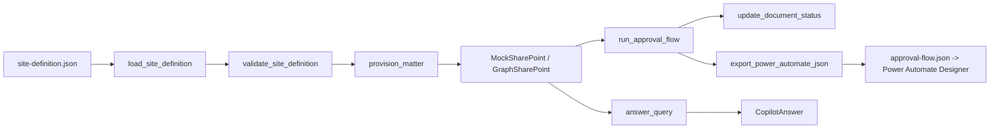
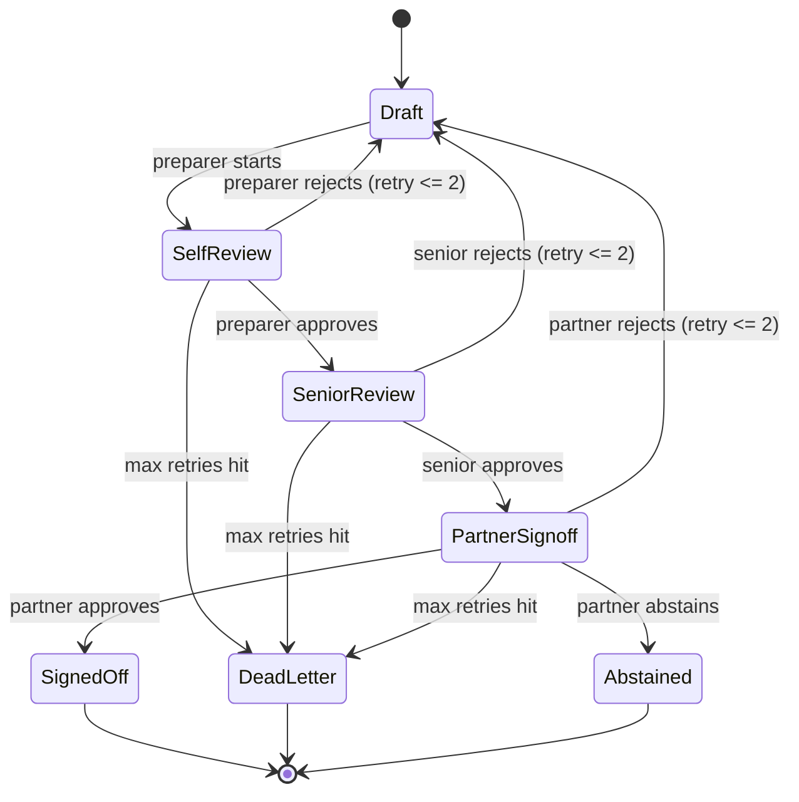
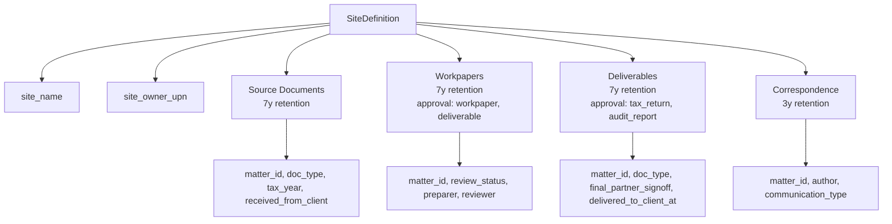

# Diagrams

## System flow

```mermaid
flowchart LR
    JSON[site-definition.json] --> LD[load_site_definition]
    LD --> V[validate_site_definition]
    V --> P[provision_matter]
    P --> B[MockSharePoint / GraphSharePoint]
    B --> AF[run_approval_flow]
    AF --> BU[update_document_status]
    B --> CI[answer_query]
    CI --> ANS[CopilotAnswer]
    AF --> EX[export_power_automate_json]
    EX --> PA[approval-flow.json -> Power Automate Designer]
```

## Approval flow state machine

```mermaid
stateDiagram-v2
    [*] --> Draft
    Draft --> SelfReview: preparer starts
    SelfReview --> SeniorReview: preparer approves
    SelfReview --> Draft: preparer rejects (retry <= 2)
    SelfReview --> DeadLetter: max retries hit
    SeniorReview --> PartnerSignoff: senior approves
    SeniorReview --> Draft: senior rejects (retry <= 2)
    SeniorReview --> DeadLetter: max retries hit
    PartnerSignoff --> SignedOff: partner approves
    PartnerSignoff --> Draft: partner rejects (retry <= 2)
    PartnerSignoff --> DeadLetter: max retries hit
    PartnerSignoff --> Abstained: partner abstains
    SignedOff --> [*]
    DeadLetter --> [*]
    Abstained --> [*]
```

## Site definition

```mermaid
flowchart TB
    S[SiteDefinition] --> SN[site_name]
    S --> SO[site_owner_upn]
    S --> L1[Source Documents<br/>7y retention]
    S --> L2[Workpapers<br/>7y retention<br/>approval: workpaper, deliverable]
    S --> L3[Deliverables<br/>7y retention<br/>approval: tax_return, audit_report]
    S --> L4[Correspondence<br/>3y retention]
    L1 --> M1[matter_id, doc_type, tax_year, received_from_client]
    L2 --> M2[matter_id, review_status, preparer, reviewer]
    L3 --> M3[matter_id, doc_type, final_partner_signoff, delivered_to_client_at]
    L4 --> M4[matter_id, author, communication_type]
```
